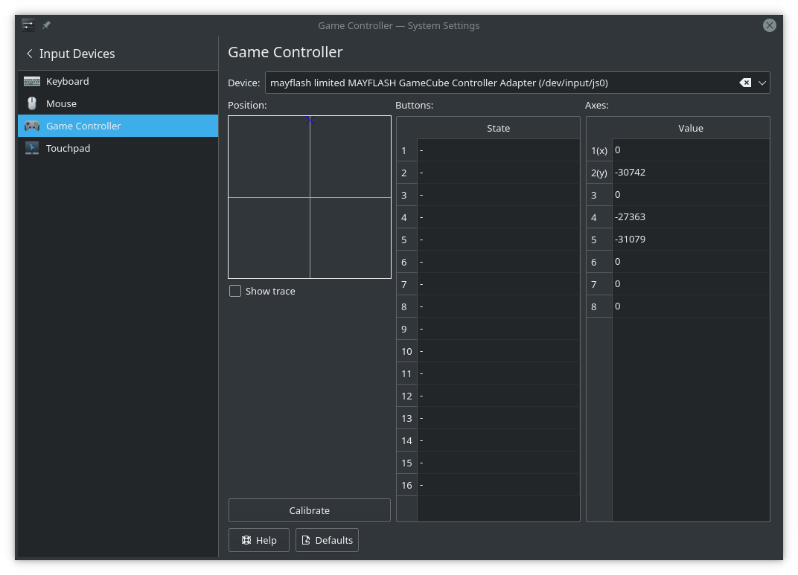

# Ninja360

Ninja360 (Formerly RockerCube) is a Bash script that takes a controller, and effectively replaces it with a functional Xbox 360 controller. It's in early stages, currently only supporting the Mayflash GameCube controller adapter, and may break. More info [here](https://www.reddit.com/r/RocketLeague/comments/6xbze6/a_guide_to_using_gamecube_controllers_in_rocket/).

## Calibration
It's important to calibrate your analog sticks so that the scaling is used. If proper calibration is not applied, things such as your character not moving as fast as it should when the analog stick is fully extended can happen. You need to use a tool which can view inputs (either for evdev or joystick inputs) to determine the maximum values for your controller. For example, with the [KDE Game Controller KCM](https://docs.kde.org/trunk5/en/kde-workspace/kcontrol/joystick/index.html):

As I moved my analog stick all the way up, axis 2(y) increased until reaching an absolute maximum of `-30742`. `30742` is now the *maximum* (given first, before `0` and the minimum) value of this axis in my controller config.